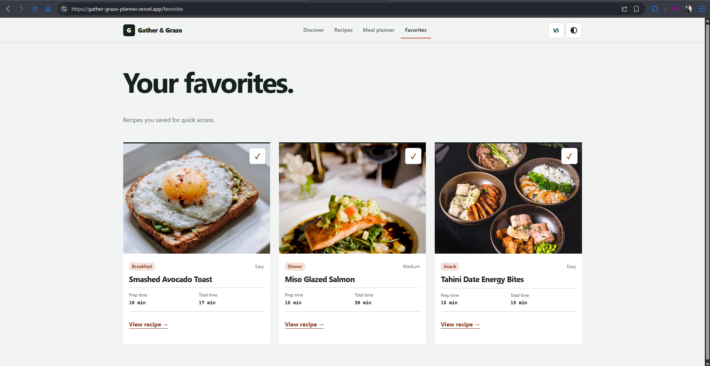

# Gather & Graze

A bilingual recipe discovery and weekly meal-planning experience built as a frontend and UX portfolio project.

[Live demo](https://gather-graze-planner.vercel.app/) · [View source](https://github.com/congy1344/gather_and_graze)

## Highlights

- Bilingual English/Vietnamese content with accent-insensitive search.
- Persistent seven-day meal planner with add, replace, remove, and undo flows.
- Accessibility-focused UI backed by automated test, lint, and build checks.

**Role / ownership:** Solo project — product design, frontend development, testing, and deployment.

**Tech stack:** React 18 · React Router 7 · Vite 8 · Context API · native CSS · Node.js test runner · GitHub Actions · Vercel


## Overview

Home cooks often decide what to eat across scattered recipe pages, saved links, and notes. Gather & Graze brings that journey into one focused flow: discover a recipe, understand the time required, save it, and place it into a weekly plan.

The project prioritizes useful product behavior over dashboard-style decoration. Every visible metric comes from the local recipe data, actions provide clear feedback, and the complete recipe content is available in both English and Vietnamese.

## Core experience

- Search recipes by localized name, ingredient, category, or tag, with accent-insensitive matching.
- Filter by meal category and sort by name or preparation time.
- Read localized ingredients and instructions, scale serving quantities, and mark cooking steps as complete.
- Save favorites and persist preferences in `localStorage`.
- Add, replace, remove, and undo meals in a seven-day planner.
- Switch between English and Vietnamese, light and dark themes, and responsive layouts.

## Product and UX decisions

- **Task-first hierarchy:** recipe name, preparation time, total time, and the next action are visually prioritized.
- **Honest content:** no invented ratings, popularity claims, nutrition data, or artificial loading delays.
- **Explicit planner states:** adding, replacing, and removing meals use distinct labels and reversible feedback.
- **Accessible interaction:** keyboard focus styles, skip navigation, route focus management, modal focus trapping, status announcements, and reduced-motion support.
- **Distinctive visual direction:** restrained color, editorial typography, varied composition, and minimal decorative UI create a recognizable visual identity.

## Screens

| Discover | Recipe collection |
| --- | --- |
|  |  |

| Weekly planner | Saved favorites |
| --- | --- |
|  |  |

## Technical approach

- React 18 and React Router 7
- Vite 8
- Context API and custom hooks
- Native CSS with design tokens and responsive breakpoints
- Node.js built-in test runner and ESLint
- GitHub Actions for test, lint, and production-build checks
- Vercel SPA rewrite support for direct route access

```text
src/
├─ components/   Reusable layout, controls, modal, and recipe UI
├─ context/      Application data and interface preferences
├─ data/         Bilingual recipe content and translations
├─ hooks/        Debounce, filtering, and local persistence
├─ pages/        Route-level product flows
├─ styles/       Tokens, responsive layout, and motion
└─ utils/        Pure, unit-tested search and planner logic
```

## Run locally

Requires Node.js 20.19 or later.

```bash
git clone https://github.com/congy1344/gather_and_graze.git
cd gather_and_graze
npm ci
npm run dev
```

## Quality checks

```bash
npm test
npm run lint
npm run build
npm audit
```

The automated tests cover bilingual recipe integrity, localized search, combined filtering and sorting, and immutable meal-plan updates. Browser integration and visual-regression tests are not included yet.

## Scope & future work

The current version is intentionally client-side and uses 12 curated local recipes, with favorites, planner data, language, and theme stored in the browser. Future iterations could add authentication, backend synchronization, nutrition data, and offline support.

## Author

Designed and developed by [Huynh Cong Y](https://github.com/congy1344).
